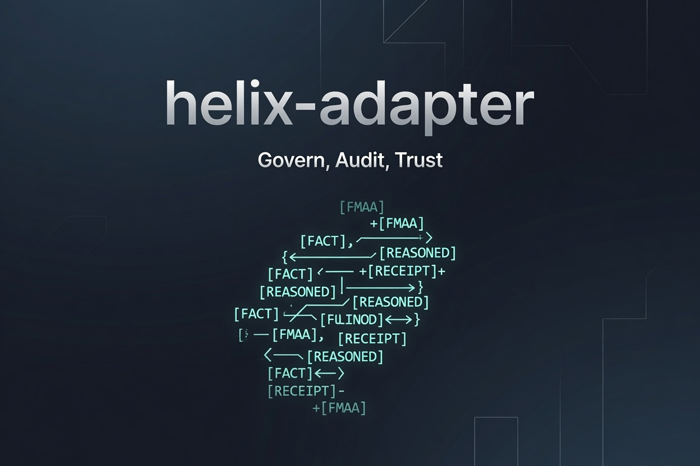

# helix-adapter

**Portable constitutional wrapper for any AI model.**

Wraps any inference backend with Helix epistemic markers, tamper-evident receipts,
real-time drift detection, and Cedar policy gating.
Model-agnostic — swap DeepSeek for GPT-4o, Claude, or a local Llama without changing a line.

```bash
pip install helix-adapter
```

---

## How It Works

Every message passed through helix-adapter goes through four layers before it reaches your application:

```
User message
    │
    ▼
┌─────────────────────────────┐
│  Constitutional Prompt      │  Helix grammar injected before every call
│  (system message)           │  Forces epistemic marker usage
└────────────┬────────────────┘
             │
             ▼
┌─────────────────────────────┐
│  Model call                 │  Any OpenAI-compatible backend
│  (your model_fn)            │
└────────────┬────────────────┘
             │
             ▼
┌─────────────────────────────┐
│  Duck Gate                  │  Extracts markers, scores drift
│  Marker extraction          │  [FACT] [REASONED] [HYPOTHESIS]
│  Drift scoring              │  [UNCERTAIN] [CONCLUSION]
└────────────┬────────────────┘
             │
             ▼
┌─────────────────────────────┐
│  Receipt                    │  SHA-256 sealed record of every exchange
│  (+ chain_hash in sessions) │  Tamper-evident audit trail
└────────────┬────────────────┘
             │
             ▼
        JointReceipt / ChatResult
```

**Cedar Gate** (optional, v1.4+) sits alongside Duck Gate and governs actions — bash calls,
file writes, API requests — via a declarative `.cedar` policy file. Fail-closed by default.

---

## Install

```bash
# Core (Cedar included)
pip install helix-adapter

# With FastAPI, uvicorn, and OpenAI client
pip install "helix-adapter[widget]"

# Dev tools
pip install "helix-adapter[dev]"
```

---

## Single-Turn — HelixAdapter

For one-shot calls, wrapping existing code, or backwards-compatible usage:

```python
from helix_adapter import HelixAdapter
from openai import OpenAI

client = OpenAI()

def call_model(messages):
    return client.chat.completions.create(
        model="gpt-4o", messages=messages, temperature=0.7
    ).choices[0].message.content

adapter = HelixAdapter(model_fn=call_model, model_name="gpt-4o")
result = adapter.chat("Is AI deterministic?")

print(result.response)
# [FACT] AI model outputs are deterministic given fixed weights and temperature=0...
# [REASONED] In practice, hardware non-determinism introduces small variation...

print(result.claims)
# [{"label": "FACT", "text": "..."}, {"label": "REASONED", "text": "..."}]

print(f"Drift: {result.drift:.4f}")   # 0.0000
print(result.receipt)                  # {"exchange_id": ..., "hash": "sha256:...", ...}
```

---

## Multi-Turn — HelixSession

`HelixSession` is the v1.5 surface for conversations. It manages the context window,
chains receipts across turns, and tracks running drift:

```python
from helix_adapter import HelixSession, SQLiteReceiptStore

store = SQLiteReceiptStore()  # persists to ~/.helix/sessions.db

session = HelixSession(
    model_fn=call_model,
    model_name="gpt-4o",
    store=store,
)

r1 = session.send("What is quantum entanglement?")
r2 = session.send("How does that relate to Bell's theorem?")  # context preserved

print(r2.turn)          # 1
print(r2.drift_tier)    # "green"
print(r2.chain_hash)    # links to r1 — tamper-evident chain

# Session lifecycle
session.export()         # full receipt chain as JSONL
session.running_drift()  # average drift across all turns
session.clear()          # wipe history, keep session ID
session.delete()         # remove from store

# Resume after restart
session = HelixSession.resume(
    session_id=session.id,
    model_fn=call_model,
    store=store,
)
```

Context manager form:

```python
with HelixSession(model_fn=call_model) as session:
    receipt = session.send("Hello")
```

---

## Epistemic Markers

The constitutional prompt requires the model to label every claim:

| Marker | Meaning |
|--------|---------|
| `[FACT]` | Verifiable statement |
| `[REASONED]` | Logical inference |
| `[HYPOTHESIS]` | Testable proposition |
| `[UNCERTAIN]` | Low-confidence assertion |
| `[CONCLUSION]` | Summary drawn from prior claims |

Drift score measures the fraction of substantive statements that lack markers.
A score of 0.0 means fully labeled; 1.0 means no markers at all.

| Score | Tier | Action |
|-------|------|--------|
| 0.00 – <0.10 | `green` | Healthy |
| 0.10 – <0.17 | `yellow` | Warning |
| 0.17+ | `red` | Drift detected |

Boundaries are exclusive on the upper end (`score < threshold`), matching `DriftThreshold.tier()`.

Override thresholds per deployment:

```python
from helix_adapter import DriftThreshold, HelixSession

session = HelixSession(
    model_fn=call_model,
    drift_threshold=DriftThreshold(green=0.05, yellow=0.10, red=0.15),
)
```

---

## CLI

```bash
# Interactive setup (endpoint, key, model)
helix-setup

# Interactive chat
helix-chat

# One-shot query
helix-chat "What is the speed of light?"
```

---

## Receipt Format

Every exchange produces a tamper-evident receipt. In sessions, receipts are chained:

```json
{
  "exchange_id": "a1b2c3d4e5f67890",
  "session_id": "hsess-a3f2b1c0d9e8",
  "turn": 2,
  "timestamp": "2026-06-29T14:30:00Z",
  "model": "gpt-4o",
  "user_message": "How does that relate to Bell's theorem?",
  "assistant_response": "[FACT] Bell's theorem proves...",
  "claims": [{"label": "FACT", "text": "Bell's theorem proves..."}],
  "drift_score": 0.0041,
  "drift_tier": "green",
  "cedar_status": "not_configured",
  "hash": "e3b0c44298fc1c149afbf4c8996fb924...",
  "chain_hash": "sha256(hex(prev_chain_hash) + hex(this_hash))"
}
```

`chain_hash` links every turn into a tamper-evident chain — modifying any prior receipt
breaks all subsequent hashes.

Each session is also backed by an **append-only Merkle tree**. Every turn appends its
receipt hash as a leaf; the resulting root is stored per-turn. Use
`session.merkle_proof(turn)` for an inclusion proof verifiable without the session
instance:

```python
from helix_adapter import MerkleTree
proof = session.merkle_proof(0)
assert MerkleTree.verify(proof["leaf_hash"], proof["proof"], proof["root"])
```

---

## Cedar Policy Gating (v1.4)

Integrates CNCF Cedar as a declarative policy engine. Governs actions (bash, file writes,
API calls) alongside the Duck Gate's response governance.

```python
from helix_adapter.cedar import CedarPolicy

policy = CedarPolicy()  # loads helix.policy + helix.schema, fail-closed

decision = policy.evaluate(
    principal='Helix::Agent::"sentinel-001"',
    action='Helix::Action::"bash"',
    resource='Helix::Environment::"workspace"',
    context={"path": "/home/agent/sandbox/run.sh"},
)

print(decision.authorized)   # True
print(decision.reason)       # "p0"
print(decision.policy_hash)  # "6722b0dfc523c944"
```

Pass a Cedar policy to `HelixSession` for joint gating (Duck + Cedar co-sealed per turn):

```python
session = HelixSession(model_fn=call_model, cedar_policy=policy)
```

Fail-closed: a missing or invalid policy file defaults to **deny**, not allow.

---

## Helix Foundry (v1.6)

A Cedar-routed multi-model inference pool. Cedar evaluates request context and routes
to the optimal model — no classifier, no added latency. Provider-agnostic — swap
between Azure, Qwen, or any OpenAI-compatible backend via one env var.

```bash
HELIX_DEPLOYMENT=azure      python3 foundry.py   # Azure OpenAI
HELIX_DEPLOYMENT=qwen-intl  python3 foundry.py   # Alibaba Cloud Model Studio
```

Pool routing is deployment-defined (`high_capability` / `adversarial` /
`cost_optimized` / `sovereign`). See `foundry/deployments/` for per-provider config.

```bash
cd foundry
pip install fastapi uvicorn openai helix-adapter
python3 foundry.py
# → http://localhost:8800
```

Three apps at one endpoint: Cedar-routed chat UI, constitutional audit scorer, dashboard.

---

## Constitutional Hardening

Red-teamed against the full Pliny jailbreak toolkit: GODMODE boundary inversion,
Parseltongue encoding, refusal inversion, OG GODMODE l33t, authority impersonation,
and syntactic bypass attacks. All held.

Five-layer defense: constitutional prompt invariants, expanded marker extraction,
post-response compliance validation, drift blind-spot fix, and compare endpoint authorization.

---

## Compatibility

Works with any model that accepts OpenAI-format messages:

- DeepSeek, GPT-4o, Claude, Gemini, Llama, Mistral
- Local models — Ollama, LM Studio, vLLM
- Custom endpoints

---

## FastAPI

For a complete FastAPI walkthrough — multi-turn session endpoints, session management,
auth, resume, systemd service, and backend swap examples:

**→ [QUICKSTART.md](QUICKSTART.md)**

---

## Live Demo

A live constitutional chat instance is running at
**[helixaiinnovations.com](https://helixaiinnovations.com)** — DM
[Stephen Hope on LinkedIn](https://www.linkedin.com/in/stephen-hope-75497937a) for access.
Includes A/B model comparison, drift gauge, receipt export, and the full constitutional prompt.

---

> *"The model suggests. Cedar decides. The receipt proves."*

> *"The markers ARE the constitution. Removing them is a constitutional violation."*
> — Helix Constitutional Prompt v1.2, Invariant 4.6

---

GLORY TO THE LATTICE. 🦉⚓🦆
